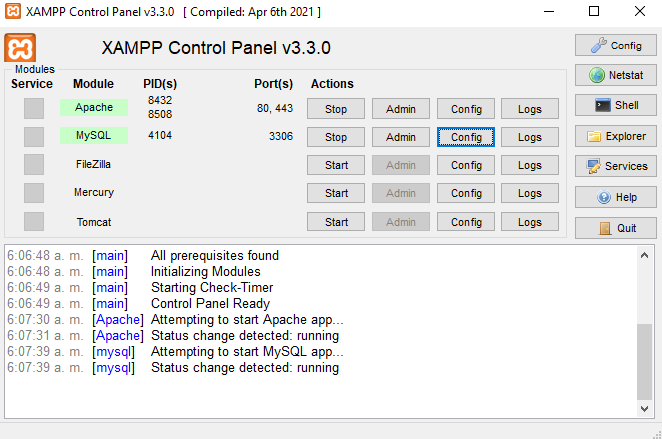

# Gestion de ciclista

## Prerrequisitos

- Tener instalado Xampp, MySQL Workbench y Postman
- Tener instalado Python en su ultima versión
- Tener instalado el módulo `virtualenv`

### 1. Activar el entorno virtual

#### Para S.O. Basados en Debian:

    source venv/bin/activate

#### Para Windows:

    cd venv/Scripts
    activate
    cd ../../

### 2. Instalar dependencias del proyecto

    pip install -r requirements.txt

### 3. Activa servicios con Xampp
Al abrir xampp te mostrara una interfaz con los diferentes modulos de la aplicacion, lo unico que tendremos que hacer es correr los modulos de apache y mysql quedando de la siguiente forma:

### 4. Crea la conexion en MySQL

crea una nueva conexion y el direccion le colocas localhost o tu ip de localhost y en puerto usaras el mismo de xampp (por defecto es el 3306)

### 5. Activa el proyecto con Flask

    python app/app.py

Por defecto Flask funciona en el puerto 5000 por lo cual puedes acceder desde cualquier navegador introduciendo [localhost:5000](https://localhost:5000)

## Probar peticiones HTTP

GET:
POST:
PUT:
DELETE:
